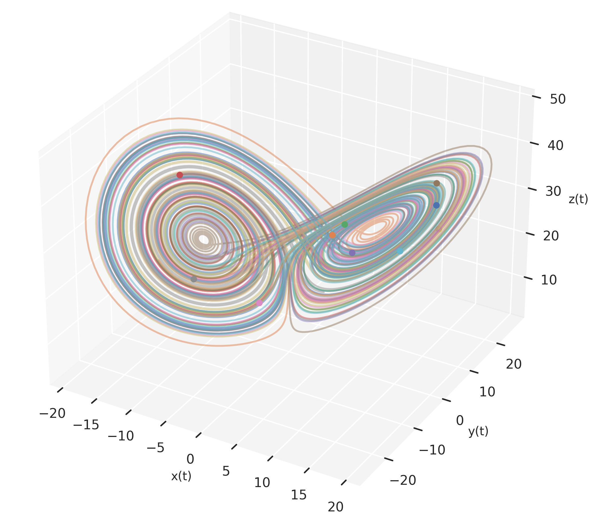

# Numerical Methods for Dynamical Systems
ระเบียบวิธีเชิงตัวเลขสำหรับระบบพลวัต


ผู้สอน: ดร.รัฐพรหม พรหมคำ




## ปีการศึกษา 2566/2
รายวิชานี้ดำเนินการสอนในรูปแบบการบรรยาย ปฏิบัติการทางคอมพิวเตอร์ 
อาจรวมถึงห้องเรียนออนไลน์หรือเป็นไปตามประกาศของทางมหาวิทยาลัยเทคโนโลยีราชมงคลธัญบุรี 


### เวลาและสถานที่เรียน

| Section | ห้องเรียน | วัน | บรรยายทฤษฏี  | ปฏิบัติการ  |
|--------|---------|----|---------------|---------------|
| 01     |  รป 6-02 | จันทร์ | 13.00 - 15.00  | 15.00 - 17.00|

สอบกลางภาค:  21 มกราคม 2567 เวลา 13.00 - 16.00

สอบปลายภาค:  19 มีนาคม 2567 เวลา 13.00 - 16.00

### ห้องเรียนออนไลน์ Microsoft Teams

| Section | Invitation Code | 
|---------|-----------------|
|     01  |  `ibf3trw`      | 

กรอกรหัสการเข้าร่วม (Invitation Code) ตามที่ระบุไว้ของแต่ละ Section ที่นักศึกษาได้ลงทะเบียนไว้ เพื่อเข้าใช้งานห้องเรียนออนไลน์


## คำอธิบายรายวิชา
การใช้ระเบียบวิธีเชิงตัวเลขสำหรับปัญหาค่าเริ่มต้นโดยวิธีออยเลอร์ วิธีเทเลอร์อันดับสูง วิธีรุงเง-คุตตา วิธีรุงเง-คุตตา-เฟฮ์ลแบร์ก และวิธีการพหุระดับแบบช่วงก้าวคงที่และช่วงก้าวแปรผัน การใช้ระเบียบวิธีเชิงตัวเลขสำหรับสมการเชิงอนุพันธ์อันดับสูงและระบบสมการเชิงอนุพันธ์ เสถียรภาพของระเบียบวิธีการ สมการเชิงอนุพันธ์แบบสติฟ การใช้ระเบียบวิธีเชิงตัวเลขสำหรับปัญหาค่าขอบโดยวิธียิงแบบเชิงเส้นและไม่เชิงเส้น, วิธีผลต่างอันตะแบบเชิงเส้นและไม่เชิงเส้น วิธีเรย์ไลย์-ริทซ์ และปฏิบัติการที่เกี่ยวข้อง
          
Euler’s method numerical method for initial value problems; Taylor’s higher-order method; Runge-Kutta’s method; Runge-Kutta-Fehlberg’s method and multi-step method with fixed and multi-step sizes; Numerical methods for higher-order differential equations and systems of differential equations; Stability; Stiff differential equations; numerical methods for linear and non-linear boundary value problems; linear and non-linear finite difference methods; Rayleigh–Ritz method and related laboratory


## จุดมุ่งหมายรายวิชา

1. ปฏิบัติตามกฎ ระเบียบ ข้อบังคับ และข้อตกลงของชั้นเรียนได้
2. คำนวณหาผลเฉลยของสมการเชิงอนุพันธ์โดยใช้ระเบียบวิธีเชิงตัวเลขสำหรับปัญหาค่าเริ่มต้นโดยวิธีออยเลอร์ วิธีเทเลอร์อันดับสูง วิธีรุงเง-คุตตา วิธีรุงเง-คุตตา-เฟฮ์ลแบร์ก วิธีการพหุระดับแบบช่วงก้าวคงที่ และช่วงก้าวแปรผันได้
3. หาผลเฉลยของสมการเชิงอนุพันธ์อันดับสูงและระบบสมการเชิงอนุพันธ์โดยใช้ระเบียบวิธีเชิงตัวเลขได้
4. อธิบายความมีเสถียรภาพของระเบียบวิธีการเชิงตัวเลขได้
5. อธิบายความหมายของสมการเชิงอนุพันธ์แบบสติฟได้
6. หาผลเฉลยของสมการเชิงอนุพันธ์โดยใช้ระเบียบวิธีเชิงตัวเลขสำหรับปัญหาค่าขอบโดยวิธีแบบเชิงเส้นและไม่เชิงเส้นได้
7. หาผลเฉลยของสมการเชิงอนุพันธ์โดยใช้วิธีผลต่างอันตะแบบเชิงเส้นและไม่เชิงเส้นได้ 
8. หาผลเฉลยของสมการเชิงอนุพันธ์โดยใช้วิธีเรย์ไลย์-ริทซ์ได้
9. เขียนหรือใช้โปรแกรมคอมพิวเตอร์ในการคํานวณทางด้านระเบียบวิธีเชิงตัวเลขสำหรับระบบพลวัตเบื้องต้นได้
10. ใช้ภาษาเพื่อสื่อสารและนำเสนอผลงานทางด้านคณิตศาสตร์ได้อย่างถูกต้อง

## หัวข้อการบรรยาย

| Topic						| 	Class Materials 		|
|---------------------------|---------------------------|
| Construction of trajectories in discrete dynamical systems  | [Lecture](./materials/lecture_01.pdf)/ [Workshop](./materials/workshop_01.ipynb) |
| Fixed-point iterative schemes with applications to dynamical systems  | [Lecture](./mateials/lecture_02.pdf)/ [Workshop](./materials/workshop_02.ipynb) |
| Initial-value problems for ordinary differential equations  | [Lecture](./mateials/lecture_03.pdf)/ [Workshop](./materials/workshop_03.ipynb) |
| Boundary-value problems for ordinary differential equations  | [Lecture](./mateials/lecture_04.pdf)/ [Workshop](./materials/workshop_04.zip) |
| MID-TERM Examination  |  |
| Approximating eigenvalues   | [Lecture](./mateials/lecture_05.pdf)/ [Workshop](./materials/workshop_05.ipynb) |
| Contruction of bifurcations and phase planes of dynamical systems    | [Lecture](./mateials/lecture_06.pdf)/ [Workshop](./materials/workshop_06.ipynb) |
| Case study I: Numerical methods in discrete dynamical systems | [Download](./materials/cases_discrete.zip)  |
| Case study II: numerical methods in continuous dynamical systems | [Download](./materials/cases_continuous.zip)  |
| Project-based Seminar I | TBA  |
| Project-based Seminar II | TBA  |
| Project-based Seminar III | TBA  |
| FINAL Examination  |  |


## การวัดผลการเรียน
คะแนนเต็ม 100 คะแนน โดยแบ่งออกเป็น
- การสอบกลางภาค 25%
- การสอบปลายภาค 25%
- งานที่ได้รับมอบหมาย 25%
- โครงงาน 25%

หากนักศึกษาเข้าเรียนน้อยกว่า 80% ของเวลาเรียนทั้งหมด
หรือได้คะแนนรวมน้อยกว่า 50% ของคะแนนเต็ม นักศึกษาจะไม่ผ่านในรายวิชานี้ และได้รับการบันทึกผลการเรียน F (เกรด 0.0) 

สำหรับนักศึกษาที่ผ่านเกณฑ์ดังกล่าว จะได้รับการบันทึกผลการเรียนตามเกณฑ์ของคะแนน t-score 

```
t-score = 50 + 10*(x - u)/s
```
เมื่อ x คือคะแนนรวม, u คือคะแนนเฉลี่ยของคะแนนรวม และ s คือส่วนเบี่ยงเบนมาตรฐานของคะแนนรวม

ดังนี้

| ผลการเรียน | เกรด | เกณฑ์ t-score |
|---------|------|--------------|
| F | 0.00 | (-Inf, 50) | 
| D | 1.00 | [50, 55) | 
| D+ | 1.50 | [55, 60) | 
| C | 2.00 | [60, 65) |
| C+ | 2.50 | [65, 70) |
| B | 3.00 | [70, 75) |
| B+ | 3.50 | [75, 80) |
| A | 4.00 | [80, Inf) |


## เอกสารอ้างอิง
- R. L. Burden and J. D. Faires, Numerical Analysis, 9 edition. Boston, MA: Cengage Learning, 2010.
- S. H. Strogatz, Nonlinear Dynamics and Chaos: With Applications to Physics, Biology, Chemistry, and Engineering, 2nd edition. Boulder, CO: CRC Press, 2015.
- S. Lynch, Dynamical Systems with Applications using Python, 1st ed. Cham: Springer, 2018.